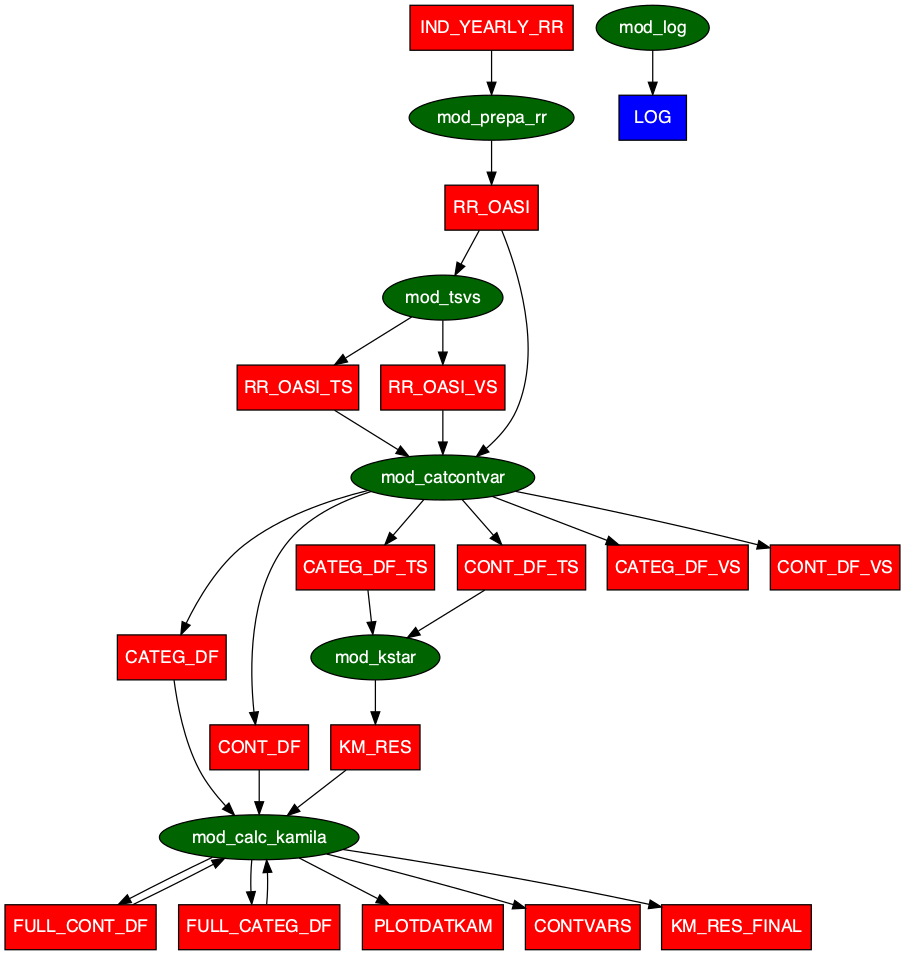

<!-- README.md is generated from README.Rmd. Please edit that file -->

```{r, include = FALSE}
knitr::opts_chunk$set(
  collapse = TRUE,
  comment = "#>",
  fig.path = "man/figures/README-",
  out.width = "100%"
)
```

# rrclust 

<!-- badges: start -->
<!-- badges: end -->

The goal of `rrclust` is to cluster the Swiss Pension Register (CCO/FSIO) using the [`kamila`](https://github.com/ahfoss/kamila) R package.

The anonymous data of the Swiss Pension Register (CCO/FSIO) are typically used to estimate and project (in the short, middle and long term) the revenues and the expenditures of the Old-Age and Survivors’ Insurance (OASI). In this perspective, it is essential to have a clear look at the register's main statistical features. To better understand it and benefit more from its richness, we propose analysing the raw data by an appropriate clustering method.

We face three main difficulties:

i) As not only continuous but also nominal or categorical variables structure the register, we have to choose a clustering method that considers any types of variables; 

ii) The a priori number of clusters should be in the first step determined, and thus the question of how to fix it is essential; 

iii) The method should run over big data.

Recently, [A. Foss et al. (2016)](https://doi.org/10.1007/s10994-016-5575-7) and [A. H. Foss and Markatou (2018)](https://doi.org/10.18637/jss.v083.i13) proposed the kamila Method (KAy-means for MIxed LArge data), which is specifically designed to manage a clustering process for mixed distributions. 
Furthermore, a simple rewriting of the kamila's algorithm permits an easy implementation in a map-reduce framework like Hadoop, thus being run on very large data sets. 
On the other hand, [Tibshirani and Walther (2005)](https://www.jstor.org/stable/27594130) advocate the use of the "Prediction Strength" as a measure to find the optimal number of clusters. 

We applied the kamila clustering method on the more than 2 000 000 observations of the Swiss Pension Register (CCO/FSIO) data. 
The technique allows us to determine the optimal number of clusters. 
On this basis, we can analyse the partition of our data. Indeed, each cluster is then analysed, and its principal features are described. 
As a result, it becomes possible to recognise the similarities and dissimilarities between the OASI pensioners subgroups according to their socio-demographic characteristics. 
These pieces of information are crucial to predicting revenues and expenditures of the OASI.

## Installation

You can install the development version of `rrclust` from [GitHub](https://github.com/) with:

``` r
# install.packages("devtools")
devtools::install_github("asam-group/rrclust")
```

## Related Paper
One needs to have the proper Swiss Pension Register (CCO/FSIO) data in order to run this code. Since 
this register is not public, you can find how it is used and learn more about the 
results in this [Working Paper](https://folia.unifr.ch/unifr/documents/324081). 

## Future work
The next step is to implement some classification methods in the package [`rrml`](https://github.com/asam-group/rrml) which will be applied 
to the kamila-clustered Swiss Pension Register (CCO/FSIO) thanks to the package [`rrclust`](https://github.com/asam-group/rrclust). 

## Flow
The global workflow of the `rrclust` package is depicted in the figure shown below.  

The green ellipses correspond to modules defined as functions accepting only a 
certain class of inputs, namely `tibbles`.
 
These `tibbles` can enter the  modules individually or in the form of lists of `tibbles`, namely `tidylists`, containing the `tibbles` in a `tidy` form needed 
by the modules.  

The red rectangles give the name of the `tibbles` which either are inputs or 
outputs of the modules. Therefore, they are the outputs of a transformation of the initial `tibbles`.

The blue rectangles depict the top level outputs, such as `LOG` indicating the run 
`log` including the `rrclust` package version, the `dplyr` library version, 
the date and the time of the code execution.

The arrows indicate the direction of the process. If there are two arrows between an ellipse and a rectangle in both directions, this means that an input has been renamed especially for this module and is given back as an output. This is the case of `FULL_CONT_DF` and `FULL_CATEG_DF` which are renamed `tibbles` of resp. `CONT_DF` and `CATEG_DF` and which contains the outcome variables `aadr` and `monthly_pension` opposite to their siblings.

```{r message=FALSE, warning=FALSE, include=FALSE}
library(rrclust)

# directory for the output
path_out <- tempdir()

# generate random demo data
path_random_data <- gen_demo_data(data_size = 100)

# read the demo data
demo_data <- tidylist_read(path_random_data)

# relative path to the params container
path <- file.path(getwd(), "inst", "extdata", "params_kamila_large")

# read PARAM_GLOBAL
tl_PARAM_GLOBAL <- param_tidylist_read(path)

# replace empty variable with the temporary path
tl_PARAM_GLOBAL$PARAM_GLOBAL[["path_data"]] <- stringr::str_remove(dirname(path_random_data), "/all")
PARAM_GLOBAL <- tl_PARAM_GLOBAL$PARAM_GLOBAL |>
  dplyr::mutate_all(as.character) |>
  tidyr::pivot_longer(
    tidyselect::everything(),
    names_to = "key",
    values_to = "value"
  )

# rewrite PARAM_GLOBAL with the demo data path
tidylist_write(tidylist(PARAM_GLOBAL), path = path)

# trace flow
TF0 <- trace_flow({
  run_kamila(path = path, path_out = path_out)
})

# remove the parameters files
TF <- TF0 |>
  # rename df into df_renamed to avoid the confusion with the function df()
  dplyr::mutate(df_renamed = df) |>
  dplyr::filter(!grepl("^PARAM", df_renamed)) |>
  dplyr::select(-df_renamed)

# five a name to the plot
name_plot <- "rrclust_flow.png"

# define a path for the graph
path_graphs <- file.path("man", "figures")

# create the directory if it does not exist
if (!file.exists(path_graphs)) {
  dir.create(path_graphs, recursive = TRUE)
}

# create the plot
plot <- draw_flow(TF)

# render the plot as SVG
tmp0 <- DiagrammeRsvg::export_svg(plot)

# convert to a raw vector
tmp <- charToRaw(tmp0) # flatten

# render svg image into a high quality bitmap
rsvg::rsvg_png(tmp, file.path(path_graphs, name_plot))

# go to the graphs directory
# browseURL(file.path(path_graphs, name_plot))
```



## Examples

Since the Swiss Pension Register (CCO/FSIO) data are not public, we offer two examples with randomly 
generated data which are used to demonstrate the workflow of this package.

### Example step by step with randomly generated data

```{r demo-step-by-step, message=FALSE, warning=FALSE, eval=FALSE}
library(rrclust)

# directory for the output
path_out <- tempdir()

# generate random demo data
path_random_data <- gen_demo_data()

# read the demo data
demo_data <- tidylist_read(path_random_data)

# relative path to the params container
path <- file.path(getwd(), "inst", "extdata", "params_kamila_large")

# read PARAM_GLOBAL
tl_PARAM_GLOBAL <- param_tidylist_read(path)

# replace empty variable with the temporary path
tl_PARAM_GLOBAL$PARAM_GLOBAL[["path_data"]] <- stringr::str_remove(dirname(path_random_data), "/all")
PARAM_GLOBAL <- tl_PARAM_GLOBAL$PARAM_GLOBAL |>
  dplyr::mutate_all(as.character) |>
  tidyr::pivot_longer(
    everything(),
    names_to = "key",
    values_to = "value"
  )

# rewrite PARAM_GLOBAL with the demo data path
tidylist_write(tidylist(PARAM_GLOBAL), path = path)

# input
tl_inp_kamila <- mod_inp_kamila(path = path, method_name = "kamila")

# computations
tl_out_kamila <- wrap_kamila(tl_inp_kamila = tl_inp_kamila)

# output
path_out_identifier <- mod_out_kamila(
  path = path,
  path_out = path_out,
  tl_inp_kamila = tl_inp_kamila,
  tl_out_kamila = tl_out_kamila
)

# write the csv files
tidylist_write(
  c(tl_out_kamila, mod_log()),
  path_out_identifier
)

# store parameters (as a reference)
copy_param(path, path_out_identifier)

# access the output
browseURL(path_out_identifier)
```


### Example in one step with randomly generated data

```{r demo-all-in-one, message=FALSE, warning=FALSE, eval=FALSE}
library(rrclust)

# directory for the output
path_out <- tempdir()

# generate random demo data
path_random_data <- gen_demo_data()

# read the demo data
demo_data <- tidylist_read(path_random_data)

# relative path to the params container
path <- file.path(getwd(), "inst", "extdata", "params_kamila_large")

# read PARAM_GLOBAL
tl_PARAM_GLOBAL <- param_tidylist_read(path)

# replace empty variable with the temporary path
tl_PARAM_GLOBAL$PARAM_GLOBAL[["path_data"]] <- stringr::str_remove(dirname(path_random_data), "/all")
PARAM_GLOBAL <- tl_PARAM_GLOBAL$PARAM_GLOBAL |>
  dplyr::mutate_all(as.character) |>
  tidyr::pivot_longer(
    everything(),
    names_to = "key",
    values_to = "value"
  )

# rewrite PARAM_GLOBAL with the demo data path
tidylist_write(tidylist(PARAM_GLOBAL), path = path)

# execute the whole workflow
rrclust::run_kamila(path = path, path_out = path_out)

# access the output
browseURL(path_out)
```

## Results

You can see the results in the CSV file named `KM_RES_FINAL.csv`. The best number of 
clusters, i.e. the parameter `kstar`, is given by the value of the variable `num_clust`.

The CSV file `KM_RES.csv` shows you all the prediction strengths values for each number of clusters for which you ran the program (see parameter `numberofclusters` in `PARAM_KAMILA.csv`) and for each iteration. 

